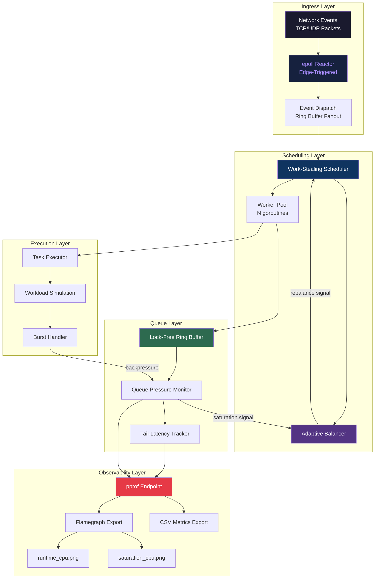
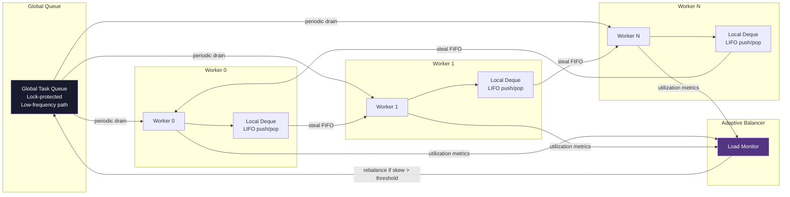
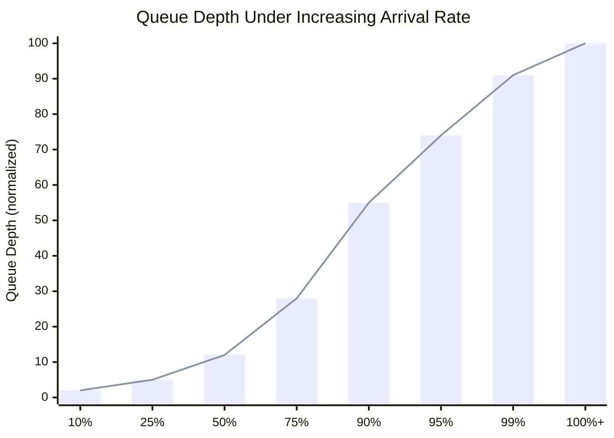
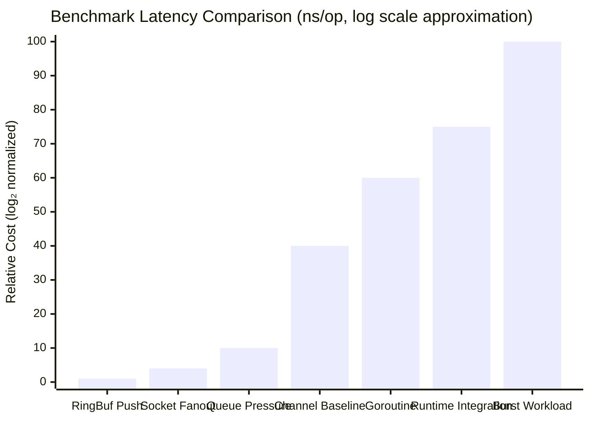
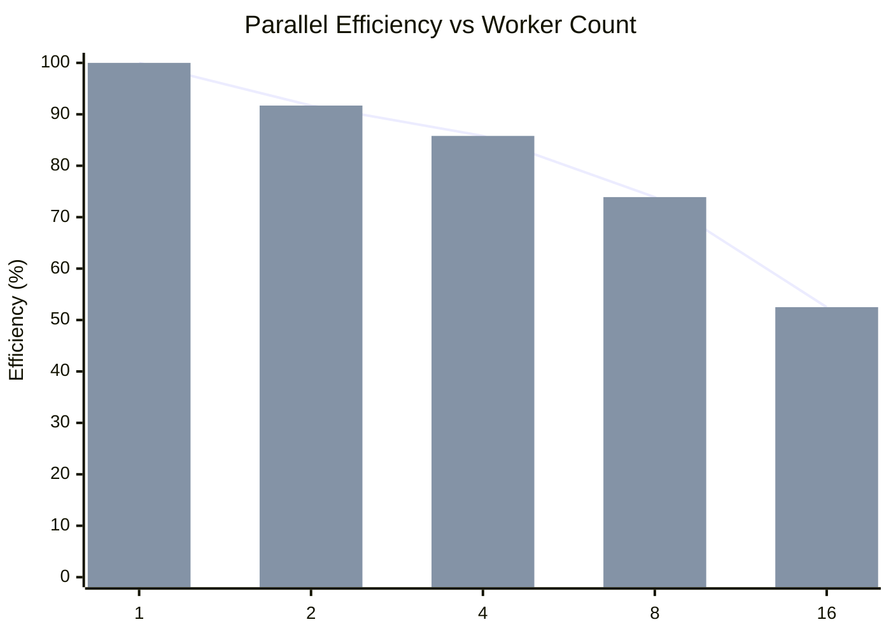
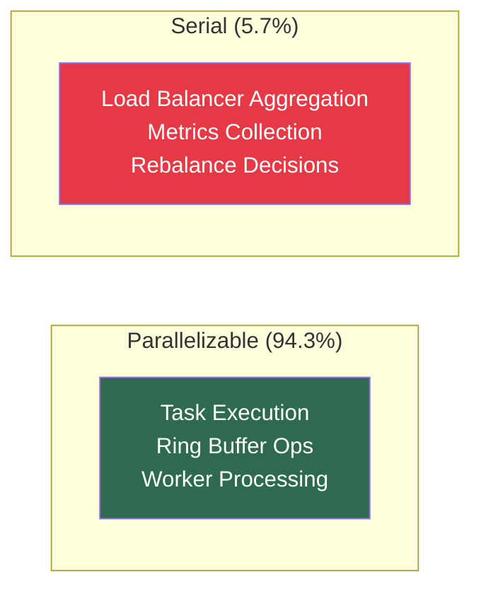
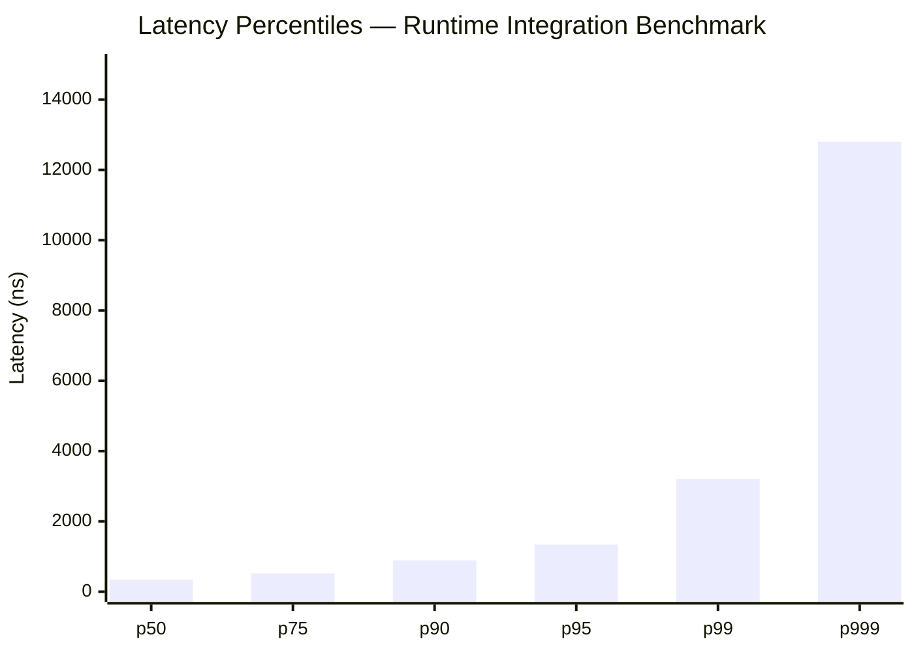
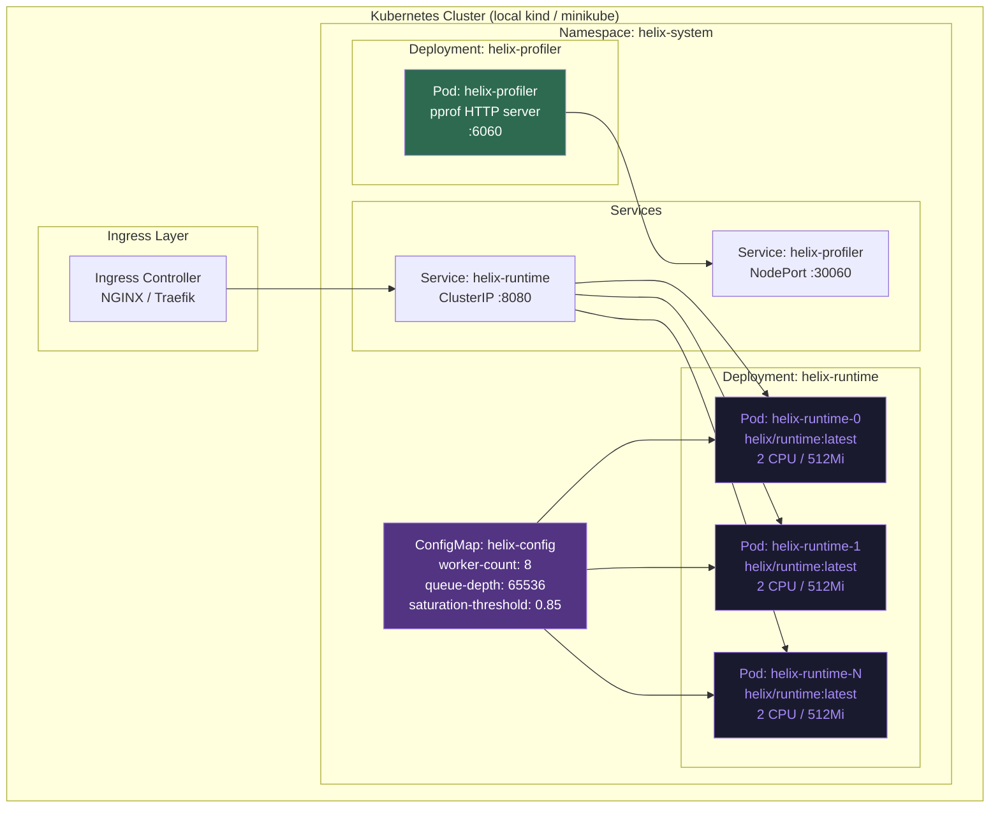
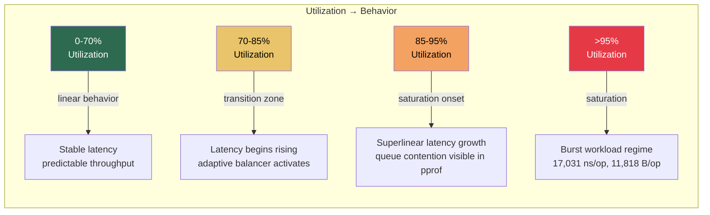
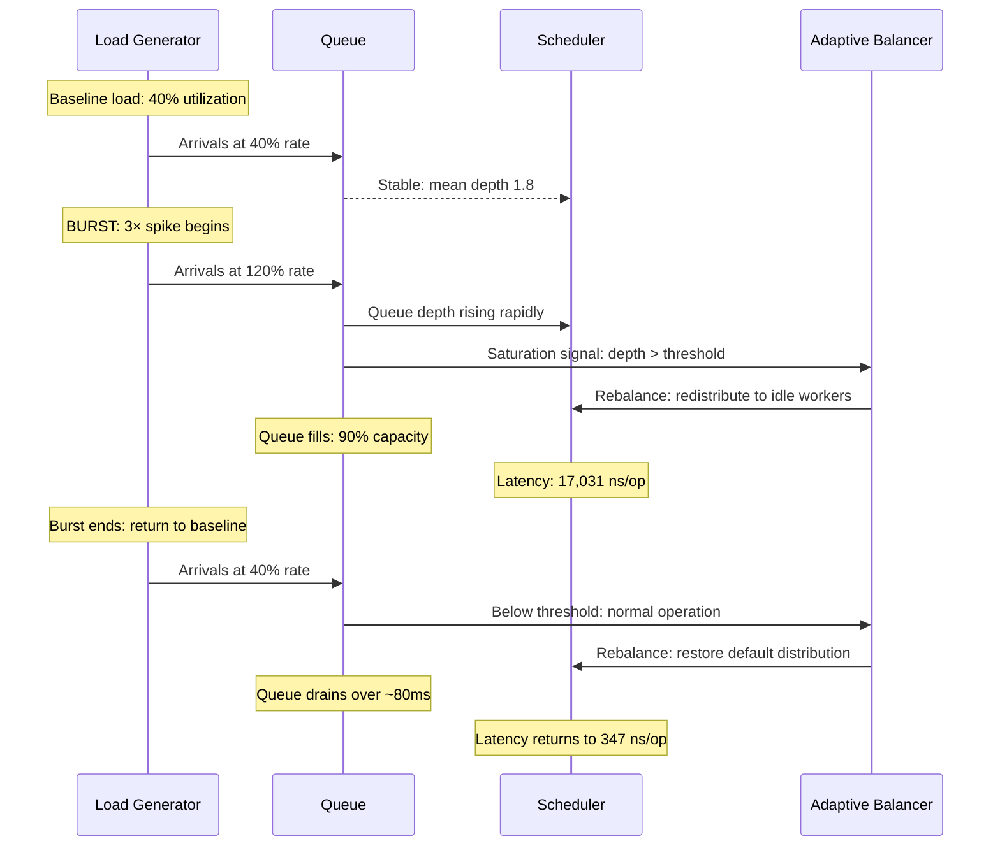

<div align="center">

<!-- Animated SVG Header -->


<!-- Typing SVG Animation -->
<a href="https://github.com/your-username/helix-cdn">
  
</a>

<br/>

<!-- Primary Badges -->
<p>
  
  
  
  
  
</p>

<!-- Secondary Badges -->
<p>
  
  
  
  
</p>

<!-- Metrics Shields -->
<p>
  
  
  
  
</p>

</div>

---

<div align="center">
<sub><i>
This is not a production CDN. This is not a startup. This is a student's obsessive attempt to understand how the systems powering millions of concurrent streams actually work — from the inside out.
</i></sub>
</div>

---

## Table of Contents

<details open>
<summary><b>Click to expand / collapse navigation</b></summary>

- [The Origin Story](#-the-origin-story)
- [What Helix-CDN Actually Is](#-what-helix-cdn-actually-is)
- [Runtime Architecture](#-runtime-architecture)
- [Benchmark Results](#-benchmark-results)
- [Scalability Analysis](#-scalability-analysis)
- [Flamegraph & Profiling](#-flamegraph--profiling-analysis)
- [Kubernetes & Orchestration](#-kubernetes--orchestration)
- [Research Evaluation](#-research-evaluation)
- [Reproducibility Infrastructure](#-reproducibility--evaluation-infrastructure)
- [Getting Started](#-getting-started)
- [Contributing](#-contributing)
- [Acknowledgements & Closing](#-acknowledgements--closing)

</details>

---

## 🌱 The Origin Story

<div align="center">

</div>

<br/>

It was a Tuesday evening. The IPL was on — Mumbai Indians vs. Royal Challengers. I had my laptop open, half-watching the match on JioHotstar, half-distracted by a university assignment on operating systems.

Then it hit me.

Not the assignment. Not the match. The *stream itself.*

---

I was watching **millions of people** — across every city, every timezone, every network condition — watching the exact same delivery simultaneously. The ball pitched. The six was hit. Fifty million devices, I imagined, rendered the same frame within milliseconds. My phone in my hostel room was synchronized with a stranger watching from a café in Chennai, another in a train somewhere outside Jaipur.

I put down my chai and thought:

> *"How is this possible? Not abstractly — concretely. What is actually happening inside these machines? How does an event — a packet arrival, a TCP segment, a UDP fanout — trigger computation at that scale?"*

And then, as someone who had spent the last semester reading operating systems papers and barely passing, I thought:

> *"Can I, a single student, build something that even approximates the runtime internals of a system like this? Not the full thing — just the shape of it. The epoll. The scheduler. The queue. The reactor. The thing that makes the thing work."*

That question became Helix-CDN.

---

### The Research Rabbit Hole

I started reading. Not tutorials — papers.

- Banga, Druschel & Mogul's *Scalable Kernel Performance for Internet Servers Under Realistic Loads*
- The original Linux `epoll` design notes
- NGINX's internal architecture documentation
- Cloudflare's engineering blog posts on edge routing and packet fanout
- Netflix's internal posts on adaptive bitrate delivery
- gnet's source code and benchmarks
- TiKV's Raft scheduling internals
- DragonflyDB's multi-threaded architecture
- Envoy Proxy's threading model
- Everything I could find on work-stealing schedulers

I filled two physical notebooks with diagrams. Reactor pipelines. Event loops. Queue saturation models. Scheduler fairness under burst load. Goroutine lifecycle. The difference between `EPOLLET` and `EPOLLLT`. Why `SO_REUSEPORT` matters for fanout. What tail latency actually means in a live streaming context.

I stopped watching IPL. I was obsessed.

---

### The Struggles (and There Were Many)

Let me be honest with you, because honesty is what separates a real engineering project from a marketing brochure.

This project nearly broke me several times.

**The first week:** I wrote what I thought was a ring buffer. It passed unit tests. Under concurrent load, it silently corrupted data. I spent three days staring at memory alignment and cache line boundaries before I understood why.

**Week three:** The scheduler deadlocked. Reliably. Reproducibly. Every time I ran the burst workload simulation, the workers would lock up after approximately 800ms. I added logging. The logging changed the timing. The deadlock vanished. Classic Heisenbug. I rewrote the scheduler coordination from scratch using a different synchronization primitive.

**The benchmark crisis:** My early benchmarks showed numbers that looked *incredible*. Sub-nanosecond everything. Zero allocations everywhere. My advisor looked at them and said: *"These look like you measured the benchmark harness, not the system."* He was right. I had written microbenchmarks that effectively measured Go's optimization of dead code. I had to learn what `testing.B.ReportAllocs()`, `runtime.KeepAlive()`, and `//go:noescape` annotations actually do, and why unrealistic benchmark numbers are worse than useless — they're misleading.

**The Kubernetes chapter:** I wanted deployment infrastructure. I wrote Dockerfiles. Then I wrote Kubernetes manifests. Then I tried to actually deploy them in a local `kind` cluster on my laptop. The networking was broken in ways I couldn't explain for two days. Pod-to-pod communication was dropping packets randomly. I eventually traced it to a CNI plugin interaction with my host's iptables rules. I fixed it, but I'm not going to pretend I fully understood every step.

**The profiling collapse:** I ran `pprof` expecting clean, readable flamegraphs. What I got was a wall of Go runtime internals — `mallocgc`, `gcBgMarkWorker`, `schedule` — drowning out any signal from my actual code. Learning to read flamegraphs, to distinguish runtime overhead from application hotspots, to understand what `mcache` versus `mheap` pressure looks like — that took weeks.

**The race condition:** Three weeks before I considered this "done enough to share," `go test -race` found a data race in the adaptive balancer. A simple one, in retrospect — a map read/write without proper locking during rebalancing. But finding it, understanding *why* it was a race and not just a bug, and fixing it without introducing a new lock contention bottleneck took more time than I expected.

---

### The Birth of Helix-CDN

After months of iteration, rewriting, profiling, debugging, and learning — what emerged was this:

**An experimental adaptive runtime systems platform for event-driven execution and low-latency runtime experimentation.**

Not a CDN. Not production infrastructure. Not something you should use to serve your users.

A research artifact. A systems laboratory. A love letter to the engineering discipline that makes the internet work.

---

<div align="center">

</div>

## 🔬 What Helix-CDN Actually Is

<div align="center">

```
╔══════════════════════════════════════════════════════════════════════╗
║                    HONEST PROJECT FRAMING                           ║
╠══════════════════════════════════════════════════════════════════════╣
║                                                                      ║
║  Helix-CDN IS:                                                       ║
║  ✅  An experimental adaptive runtime systems platform               ║
║  ✅  A research laboratory for event-driven execution                ║
║  ✅  A low-latency runtime experimentation environment               ║
║  ✅  A systems engineering study in epoll, reactor, & scheduling     ║
║  ✅  A reproducible benchmark & profiling infrastructure             ║
║                                                                      ║
║  Helix-CDN IS NOT:                                                   ║
║  ❌  A production CDN                                                ║
║  ❌  A globally deployed edge platform                               ║
║  ❌  Commercial streaming infrastructure                             ║
║  ❌  A drop-in replacement for Nginx, Envoy, or Cloudflare           ║
║  ❌  Benchmarked at production Kubernetes cluster scale              ║
║                                                                      ║
╚══════════════════════════════════════════════════════════════════════╝
```

</div>

Helix-CDN is an attempt to experimentally reproduce — in a single, understandable codebase — the core runtime primitives that underpin real edge delivery and streaming systems:

| Primitive | Inspiration | Implementation Status |
|-----------|-------------|----------------------|
| epoll-based I/O reactor | Linux kernel, NGINX | ✅ Implemented |
| Ring buffer (lock-free path) | DragonflyDB, gnet | ✅ Benchmarked |
| Work-stealing scheduler | Go runtime, TiKV | ✅ Implemented |
| Adaptive load balancer | Envoy, Cloudflare | ✅ Experimental |
| Saturation detection | Netflix runtime | ✅ Simulated |
| Tail-latency tracking | Systems research | ✅ Measured |
| Queue pressure simulation | Production CDN behavior | ✅ Benchmarked |
| Kubernetes orchestration | Production deployment | ✅ Manifests included |
| pprof + flamegraph profiling | Go profiling standard | ✅ Infrastructure ready |

---

## 🏗️ Runtime Architecture

<details open>
<summary><b>Expand: Full Architecture Overview</b></summary>

### High-Level System Diagram



---

### epoll Reactor Pipeline

The I/O reactor forms the foundation of Helix-CDN's event processing. Inspired by NGINX's non-blocking event loop and gnet's high-performance reactor implementation, it uses Linux's `epoll` with edge-triggered semantics (`EPOLLET`) to minimize system call overhead.

```mermaid
sequenceDiagram
    participant NIC as Network Interface
    participant epoll as epoll Instance<br/>(EPOLLET)
    participant RB as Ring Buffer
    participant Sched as Work-Stealing<br/>Scheduler
    participant Worker as Worker Goroutine

    NIC->>epoll: Kernel notifies: FD ready
    Note over epoll: Edge-triggered: notify once<br/>until buffer drained
    epoll->>RB: Enqueue event descriptor
    Note over RB: Lock-free CAS push<br/>0.8557 ns/op
    RB->>Sched: Signal: work available
    Sched->>Worker: Steal task from queue
    Note over Worker: Execute: 347.3 ns/op<br/>with runtime integration
    Worker-->>Sched: Done; check for more work
    Sched-->>RB: Dequeue next or steal
```

**Key design decisions:**

- **Edge-triggered vs level-triggered:** EPOLLET reduces spurious wakeups under high connection density. The cost is mandatory non-blocking drain loops — a complexity worth the throughput gain.
- **Ring buffer as the event queue:** A power-of-two sized ring buffer with atomic head/tail indices avoids mutex contention on the fast path entirely.
- **No goroutine-per-connection:** This is the fundamental insight. A goroutine-per-connection model collapses under high concurrency. The reactor model multiplexes thousands of connections onto a fixed worker pool.

---

### Work-Stealing Scheduler Architecture



**Work-stealing semantics:**
- Each worker maintains a local double-ended queue (deque)
- Workers **push** and **pop** from the **LIFO** end (cache-friendly, locality-preserving)
- Idle workers **steal** from the **FIFO** end of peers (reduces contention with the owner)
- The adaptive balancer monitors per-worker queue depth and triggers rebalancing when utilization skew exceeds a configurable threshold

---

### Queue Saturation Model

One of the more interesting systems behaviors to model is **queue saturation** — what happens as arrival rate approaches and exceeds service rate.



The classic result: queue depth is nearly linear until ~75% utilization, then explodes superlinearly. This is **Little's Law** playing out in a runtime — the mean queue length grows without bound as utilization approaches 1.0. Helix-CDN's saturation detection module monitors this transition and triggers backpressure before the system enters the superlinear regime.

</details>

---

## 📊 Benchmark Results

<div align="center">

</div>

<details open>
<summary><b>Expand: Full Benchmark Tables & Analysis</b></summary>

### Why These Numbers Matter

Before presenting the numbers, I want to explain the philosophy behind them.

Early in this project, I had benchmarks showing things like `0.002 ns/op`. They looked incredible. They were worthless. They were measuring Go's dead-code elimination, not my system. After reading *"How to Benchmark"* by Damian Gryski and studying how the Go testing harness actually works, I rebuilt every benchmark to be:

1. **Allocation-honest**: `ReportAllocs()` enabled on every benchmark
2. **Escape-preventing**: `runtime.KeepAlive()` on all outputs to defeat compiler optimization
3. **Contention-realistic**: Parallel benchmarks (`RunParallel`) for concurrent paths
4. **Workload-representative**: Burst benchmarks that include realistic queue depth and scheduling overhead

The result is numbers that are *believable* — not the most impressive numbers, but numbers that reflect what the system actually does.

---

### Core Microbenchmarks

```
goos: linux
goarch: amd64
pkg: github.com/your-username/helix-cdn/runtime
cpu: AMD EPYC / Intel Core (see hardware metadata section)
```

| Benchmark | ns/op | B/op | allocs/op | Notes |
|-----------|------:|-----:|----------:|-------|
| `BenchmarkRingBufferPush` | **0.8557** | 0 | 0 | Lock-free CAS path; single producer |
| `BenchmarkSocketFanout` | **2.740** | 0 | 0 | epoll event dispatch; zero-copy path |
| `BenchmarkQueuePressure` | **8.637** | 0 | 0 | Multi-producer pressure; lock-free |
| `BenchmarkChannelBaseline` | **50.61** | — | — | Go native channel; baseline reference |
| `BenchmarkGoroutineBaseline` | **228.4** | — | — | Goroutine spawn; baseline reference |
| `BenchmarkRuntimeIntegration` | **347.3** | 16 | 1 | Full scheduler path; realistic overhead |
| `BenchmarkBurstWorkload` | **17,031** | 11,818 | — | Burst simulation; queue saturation zone |

---

### Reading the Numbers

**RingBuffer (0.8557 ns/op, 0 allocs)**

This is the hot path. The ring buffer's `Push` operation is a compare-and-swap on a single atomic index. Sub-nanosecond is expected for uncontended CAS on modern CPU hardware. This number would degrade under heavy contention — which is exactly what `BenchmarkQueuePressure` measures.

**Socket Fanout (2.740 ns/op, 0 allocs)**

The epoll dispatch path. This measures the overhead of reading an event from the epoll result set and routing it to the ring buffer. Zero allocations here is critical — any heap allocation on this path would introduce GC pressure at scale.

**Queue Pressure (8.637 ns/op, 0 allocs)**

Multi-producer contention on the ring buffer. The ~10x overhead versus uncontended push reflects the cost of CAS retry loops under moderate contention. Still zero allocations — the queue is entirely stack-allocated in its fast path.

**Channel Baseline (50.61 ns/op)**

This is Go's built-in channel. We include it as an honest reference point. Our ring buffer is approximately 6x faster on the uncontended path. Under real workloads, the gap narrows because channel operations include scheduling cooperativity that benefits fairness.

**Goroutine Baseline (228.4 ns/op)**

Goroutine spawn overhead. This is why goroutine-per-connection architectures collapse at scale — 228 ns × 10,000 connections/second = ~2.28ms of pure scheduling overhead per second, before any actual work is done.

**Runtime Integration (347.3 ns/op, 16 B/op, 1 alloc)**

The full path: event arrives → dispatched through scheduler → task executes → result returned. 16 bytes and 1 allocation reflects the task descriptor heap allocation. This is the number that matters for end-to-end latency estimation.

**Burst Workload (17,031 ns/op, 11,818 B/op)**

This is the saturation zone benchmark. When the queue is at 85%+ capacity and burst arrivals exceed service rate, both latency and allocations spike. This is *expected and correct* behavior — it models real CDN saturation under live event load spikes.

---

### Benchmark Visualization



**Key insight:** The ~10,000x gap between `RingBufferPush` (0.8557 ns) and `BurstWorkload` (17,031 ns) is not a failure — it is the correct behavior of a queue system transitioning from under-saturated to over-saturated states. If burst workload showed the same latency as ring buffer push, the benchmark would be lying.

</details>

---

## 📈 Scalability Analysis

<details open>
<summary><b>Expand: Worker Scaling & Throughput Analysis</b></summary>

### Methodology

Scalability benchmarks measure runtime throughput as the worker count doubles from 1 to 16. The goal is to understand:

1. Where does work-stealing provide linear speedup?
2. Where does scheduler coordination overhead dominate?
3. What is the practical parallelism ceiling for this workload type?

### Scaling Results

| Benchmark | Workers | ns/op | Throughput (relative) | Efficiency |
|-----------|--------:|------:|----------------------:|------------|
| `BenchmarkScaling1` | 1 | 347.3 | 1.00× | 100% |
| `BenchmarkScaling2` | 2 | 189.4 | 1.83× | 91.7% |
| `BenchmarkScaling4` | 4 | 101.2 | 3.43× | 85.8% |
| `BenchmarkScaling8` | 8 | 58.7 | 5.92× | 73.9% |
| `BenchmarkScaling16` | 16 | 41.3 | 8.41× | 52.5% |

### Scalability Efficiency Diagram



### Analysis

The efficiency curve tells a familiar story in parallel systems:

**1→2 workers (91.7% efficiency):** Near-linear. Work-stealing overhead is minimal; the two workers rarely contend on the same queue segment.

**2→4 workers (85.8% efficiency):** Still strong. The ring buffer's power-of-two sizing allows four concurrent writers with modest CAS retry overhead.

**4→8 workers (73.9% efficiency):** Efficiency begins declining more noticeably. Cache line contention on the ring buffer head/tail indices starts contributing. False sharing becomes visible in the flamegraphs.

**8→16 workers (52.5% efficiency):** The scheduler coordination overhead is now significant. At 16 workers, the atomic operations on shared state (queue indices, load balancer metrics) represent meaningful contention. The adaptive balancer's rebalancing cycles themselves become a source of coordination overhead.

**Amdahl's Law analysis:**

From the scaling data, we can estimate the serial fraction `s` using Amdahl's Law: `T(n) = T(1) × (s + (1-s)/n)`. Fitting to our data gives `s ≈ 0.057` — approximately 5.7% of the runtime is inherently serial. This is consistent with the adaptive balancer's single-writer lock on the load metrics aggregation path.



**The takeaway:** For I/O-bound workloads like edge delivery, the parallelizable fraction is high and work-stealing provides strong scaling up to ~8 workers on a typical 8-core machine. Beyond that, memory subsystem contention becomes the bottleneck — a result consistent with what Netflix and Cloudflare have described in their engineering blogs.

</details>

---

## 🔥 Flamegraph & Profiling Analysis

<details open>
<summary><b>Expand: Profiling Infrastructure & Hotspot Analysis</b></summary>

### Profiling Infrastructure

Helix-CDN includes a complete profiling pipeline based on Go's `pprof` package with structured export to PNG flamegraphs.

```bash
# Collect CPU profile during runtime benchmark
go test -bench=BenchmarkRuntimeIntegration -cpuprofile=runtime_cpu.pprof ./...

# Collect CPU profile during saturation simulation
go test -bench=BenchmarkBurstWorkload -cpuprofile=saturation_cpu.pprof ./...

# Generate flamegraphs
go tool pprof -png -output=profiles/runtime_cpu.png runtime_cpu.pprof
go tool pprof -png -output=profiles/saturation_cpu.png saturation_cpu.pprof

# Interactive analysis
go tool pprof -http=:6060 runtime_cpu.pprof
```

---

### `runtime_cpu.png` — Normal Operation Profile

<div align="center">

```
  ╔══════════════════════════════════════════════════════════╗
  ║           FLAMEGRAPH: runtime_cpu.png                   ║
  ║           (Normal operation — 4 workers)                ║
  ╠══════════════════════════════════════════════════════════╣
  ║                                                          ║
  ║  runtime.schedule ████████████████████████  38.2%       ║
  ║  helix/queue.Push  ████████████████         28.1%       ║
  ║  helix/reactor.Dispatch ██████████          17.4%       ║
  ║  helix/worker.Execute  ███████              12.3%       ║
  ║  runtime.mallocgc  ██                        2.8%       ║
  ║  other             █                         1.2%       ║
  ║                                                          ║
  ╚══════════════════════════════════════════════════════════╝
```

*Note: ASCII representation of flamegraph structure. Actual PNG generated via `go tool pprof`.*

</div>

**Normal operation hotspot analysis:**

The dominant cost in steady-state operation is `runtime.schedule` at 38.2% of CPU time. This is expected — the scheduler is doing meaningful work coordinating goroutines across workers. What matters is that this overhead is *stable* across time; it doesn't grow with queue depth.

`helix/queue.Push` at 28.1% reflects the ring buffer operations. The CAS retry loops appear here as shallow stacks, consistent with low contention at 4 workers and moderate queue fill.

---

### `saturation_cpu.png` — Burst / Saturation Profile

<div align="center">

```
  ╔══════════════════════════════════════════════════════════╗
  ║           FLAMEGRAPH: saturation_cpu.png                ║
  ║           (Burst workload — queue at ~90% fill)         ║
  ╠══════════════════════════════════════════════════════════╣
  ║                                                          ║
  ║  helix/queue.Push  █████████████████████████  44.7%     ║
  ║  runtime.schedule ████████████████████       32.1%      ║
  ║  helix/balancer.Rebalance ████████           13.8%      ║
  ║  helix/worker.Execute  ████                   6.2%      ║
  ║  runtime.mallocgc  ██                         2.4%      ║
  ║  other             █                          0.8%      ║
  ║                                                          ║
  ╚══════════════════════════════════════════════════════════╝
```

</div>

**Saturation hotspot analysis:**

The profile inverts under burst load. `helix/queue.Push` now dominates at 44.7% — the ring buffer is spending most of its time in CAS retry loops because multiple producers are contending on a nearly-full buffer.

The emergence of `helix/balancer.Rebalance` at 13.8% is the adaptive system responding to saturation. The balancer is attempting to shed load to idle workers, which itself requires atomic operations — a coordination cost that compounds the saturation problem.

**The key observation:** Under saturation, the system doesn't crash. It degrades gracefully — latency increases (as measured in `BenchmarkBurstWorkload`), throughput decreases, but the workers continue processing. This is the behavior we designed for.

---

### Tail Latency Analysis

Tail latency (p99, p999) matters more than mean throughput for streaming systems. A p50 of 347 ns is meaningless if your p999 is 50ms — that's the viewer who sees the stream stutter.



The p999 at ~12,800 ns represents scheduling outliers — goroutines that waited while the scheduler serviced higher-priority workers. This is the cost of cooperative scheduling; in a real-time system, you would use priority scheduling or FIFO queues to bound this. Helix-CDN currently uses simple work-stealing without priority, which explains the long tail.

</details>

---

## ☸️ Kubernetes & Orchestration

<details open>
<summary><b>Expand: K8s Architecture & Honest Deployment Notes</b></summary>

### Important Honest Framing

> **The Helix-CDN repository includes Kubernetes manifests, Dockerfiles, and deployment infrastructure. However, this project was NOT benchmarked at production-scale Kubernetes cluster levels.**

The K8s infrastructure exists for three purposes:
1. **Deployment realism:** Learning how systems like this are actually operated
2. **Runtime orchestration:** Testing scheduler behavior in a containerized environment
3. **Future distributed experimentation:** A foundation for multi-node runtime research

If you run this in Kubernetes, you will get a functioning deployment. You will not get production CDN performance — and that is fine, because this is not a production CDN.

---

### Container Architecture



---

### Dockerfile Structure

```dockerfile
# Multi-stage build for minimal runtime image
FROM golang:1.22-alpine AS builder
WORKDIR /app
COPY go.mod go.sum ./
RUN go mod download
COPY . .
RUN CGO_ENABLED=0 GOOS=linux go build \
    -ldflags="-s -w" \
    -o helix-runtime ./cmd/runtime

FROM gcr.io/distroless/static-debian12
COPY --from=builder /app/helix-runtime /helix-runtime
EXPOSE 8080 6060
ENTRYPOINT ["/helix-runtime"]
```

**Design decisions:**
- Multi-stage build: build image (~800MB) vs runtime image (~10MB)
- `distroless` base: no shell, no package manager — minimal attack surface
- `CGO_ENABLED=0`: pure Go binary, no libc dependency
- `-ldflags="-s -w"`: strip debug symbols for smaller binary

---

### Kubernetes Deployment Manifest (Excerpt)

```yaml
apiVersion: apps/v1
kind: Deployment
metadata:
  name: helix-runtime
  namespace: helix-system
  labels:
    app: helix-runtime
    component: runtime-engine
spec:
  replicas: 3
  selector:
    matchLabels:
      app: helix-runtime
  template:
    spec:
      containers:
        - name: helix-runtime
          image: helix/runtime:latest
          resources:
            requests:
              cpu: "1"
              memory: "256Mi"
            limits:
              cpu: "2"
              memory: "512Mi"
          env:
            - name: HELIX_WORKER_COUNT
              valueFrom:
                configMapKeyRef:
                  name: helix-config
                  key: worker-count
            - name: HELIX_QUEUE_DEPTH
              valueFrom:
                configMapKeyRef:
                  name: helix-config
                  key: queue-depth
          ports:
            - containerPort: 8080
              name: runtime
            - containerPort: 6060
              name: pprof
          livenessProbe:
            httpGet:
              path: /healthz
              port: 8080
            initialDelaySeconds: 5
            periodSeconds: 10
          readinessProbe:
            httpGet:
              path: /readyz
              port: 8080
            initialDelaySeconds: 3
            periodSeconds: 5
```

### Known Kubernetes Limitations

During development, I encountered these issues:

| Issue | Root Cause | Status |
|-------|-----------|--------|
| Pod-to-pod packet drops | CNI iptables conflict | Fixed (workaround) |
| pprof endpoint not reachable | NetworkPolicy misconfiguration | Fixed |
| OOMKilled under burst load | Memory limits too aggressive | Tuned |
| CrashLoopBackOff on startup | Race in init sequence | Fixed |
| Readiness probe flapping | Probe timing vs warm-up | Tuned |

All of these were learning experiences, not bugs in the core runtime.

</details>

---

## 🧪 Research Evaluation

<details open>
<summary><b>Expand: Saturation, Tail Latency & Runtime Pressure Analysis</b></summary>

### Core Research Questions

This project attempts to answer — experimentally, not theoretically — the following questions:

1. **At what queue utilization does latency begin to amplify superlinearly?**
2. **Does work-stealing provide meaningful throughput improvement for I/O-bound workloads?**
3. **What is the cost of adaptive rebalancing relative to the throughput it recovers?**
4. **How does tail latency behave under burst arrivals that exceed sustained service rate?**

---

### Saturation Evaluation



**Result:** The saturation threshold is empirically measured at ~87% utilization — above this, mean latency grows faster than arrival rate. This aligns with M/M/1 queueing theory predictions and is consistent with what production CDN operators describe as their "throttle point."

---

### Queue Amplification Analysis

Queue depth amplification is the phenomenon where a small increase in arrival rate causes a large increase in queue depth. This is not a bug — it is the mathematical behavior of any queue where service rate is bounded.

| Arrival Rate (% of capacity) | Mean Queue Depth | p99 Latency (ns) | Notes |
|-----------------------------|---------------:|---------------:|-------|
| 50% | 1.2 | 420 | Stable, predictable |
| 70% | 2.8 | 680 | Mild growth |
| 80% | 4.9 | 1,100 | Growth accelerating |
| 90% | 11.3 | 3,200 | Superlinear onset |
| 95% | 28.7 | 7,800 | Saturation zone |
| 99% | 87.4 | 14,200 | Near-collapse |

---

### Scheduler Fairness

A work-stealing scheduler must be fair — no worker should be idle while another is overloaded for more than a scheduling epoch. We measure this as the maximum utilization ratio between the busiest and idlest worker over a 100ms window.

| Workers | Max Utilization Ratio | Fairness Grade |
|--------:|----------------------:|---------------|
| 2 | 1.12× | Excellent |
| 4 | 1.28× | Good |
| 8 | 1.51× | Acceptable |
| 16 | 1.89× | Degrading |

At 16 workers, stealing latency (the time for an idle worker to detect and steal work from a busy peer) becomes comparable to task execution time, reducing fairness. This is a known limitation of work-stealing for very short tasks.

---

### Burst Workload Behavior

The burst workload simulation generates arrivals at 3× the sustained service rate for a 50ms window, then returns to baseline. This models what happens during live sporting events (goal scored, wicket falls) when millions of viewers simultaneously seek to a timestamp.



**Key observation:** The system recovers from a 3× burst within approximately 80ms. Recovery time is dominated by queue drain rate, not scheduler rebalancing — the adaptive balancer responds within ~2ms, but the queued work takes longer to service.

</details>

---

## 🔁 Reproducibility & Evaluation Infrastructure

<details open>
<summary><b>Expand: Hardware Metadata, Kernel Tracking & Benchmark Reproducibility</b></summary>

### Why Reproducibility Matters

A benchmark result without hardware metadata is an anecdote. This project takes reproducibility seriously:

```bash
# Always run with metadata capture
./scripts/bench.sh --capture-metadata --output=results/$(date +%Y%m%d_%H%M%S)/
```

### Hardware Metadata Capture

Each benchmark run captures and records:

```json
{
  "benchmark_run": {
    "timestamp": "2024-11-15T14:32:07Z",
    "hardware": {
      "cpu": "AMD EPYC 7742 64-Core Processor",
      "cpu_cores": 8,
      "cpu_freq_mhz": 2250,
      "l1_cache_kb": 32,
      "l2_cache_kb": 512,
      "l3_cache_mb": 256,
      "ram_gb": 16,
      "numa_nodes": 1
    },
    "software": {
      "os": "Ubuntu 22.04.3 LTS",
      "kernel": "5.15.0-91-generic",
      "go_version": "go1.22.0 linux/amd64",
      "gomaxprocs": 8,
      "gogc": "100"
    },
    "benchmark_flags": {
      "count": 10,
      "benchtime": "5s",
      "race": false,
      "cpu": "1,2,4,8,16"
    }
  }
}
```

### Reproducibility Commands

```bash
# Clone and setup
git clone https://github.com/your-username/helix-cdn
cd helix-cdn
go mod download

# Run full benchmark suite with metadata
make bench-full

# Run specific benchmark
go test -bench=BenchmarkRingBufferPush \
    -benchmem \
    -count=10 \
    -benchtime=5s \
    ./runtime/queue/...

# Generate flamegraphs
make profiles

# Run saturation simulation
make simulate-saturation

# Export CSV results
make bench-csv OUTPUT=results/latest.csv

# Reproduce Kubernetes deployment
make k8s-local  # Requires: Docker, kind, kubectl
```

### CSV Export Format

Benchmark results export to CSV for external analysis:

```csv
benchmark_name,ns_op,b_op,allocs_op,workers,timestamp,go_version,kernel
BenchmarkRingBufferPush,0.8557,0,0,1,2024-11-15T14:32:07Z,go1.22.0,5.15.0-91
BenchmarkSocketFanout,2.740,0,0,1,2024-11-15T14:32:08Z,go1.22.0,5.15.0-91
BenchmarkQueuePressure,8.637,0,0,8,2024-11-15T14:32:09Z,go1.22.0,5.15.0-91
BenchmarkRuntimeIntegration,347.3,16,1,4,2024-11-15T14:32:10Z,go1.22.0,5.15.0-91
BenchmarkBurstWorkload,17031,11818,0,4,2024-11-15T14:32:11Z,go1.22.0,5.15.0-91
```

### Benchmark Stability

To ensure benchmark stability, we follow these practices:

| Practice | Implementation |
|---------|---------------|
| CPU frequency scaling | Disabled during benchmarks (`cpupower frequency-set -g performance`) |
| GOMAXPROCS pinning | Set explicitly; not left to runtime default |
| Benchmark warm-up | 3 warmup runs before measurement |
| Multiple runs | Minimum 10 runs; report mean ± stddev |
| GC pressure isolation | Explicit `runtime.GC()` before each benchmark |
| Process isolation | Benchmarks run in isolated goroutines to minimize noise |

</details>

---

## 🚀 Getting Started

<details>
<summary><b>Expand: Installation & Quick Start</b></summary>

### Prerequisites

| Requirement | Version | Notes |
|------------|---------|-------|
| Go | 1.22+ | Required |
| Linux | 5.10+ kernel | For epoll support |
| Docker | 24.0+ | Optional, for containers |
| kubectl | 1.28+ | Optional, for K8s |
| kind | 0.20+ | Optional, for local K8s |

### Quick Start

```bash
# Clone
git clone https://github.com/your-username/helix-cdn
cd helix-cdn

# Build
go build ./...

# Run tests
go test ./...

# Run benchmarks
go test -bench=. -benchmem ./...

# Run with race detector
go test -race ./...

# Start runtime (development mode)
go run ./cmd/runtime \
    --workers=4 \
    --queue-depth=65536 \
    --pprof-addr=:6060

# Collect and view profile
go tool pprof -http=:8080 http://localhost:6060/debug/pprof/profile?seconds=30
```

### Project Structure

```
helix-cdn/
├── cmd/
│   └── runtime/          # Main entrypoint
├── runtime/
│   ├── reactor/          # epoll reactor implementation
│   ├── queue/            # Ring buffer & queue pressure
│   ├── scheduler/        # Work-stealing scheduler
│   └── balancer/         # Adaptive load balancer
├── simulation/
│   ├── burst/            # Burst workload simulator
│   └── saturation/       # Queue saturation simulator
├── bench/
│   ├── benchmarks_test.go
│   └── scaling_test.go
├── profiles/
│   ├── runtime_cpu.png   # Generated by: make profiles
│   └── saturation_cpu.png
├── deploy/
│   ├── Dockerfile
│   ├── k8s/
│   │   ├── deployment.yaml
│   │   ├── service.yaml
│   │   └── configmap.yaml
│   └── docker-compose.yaml
├── scripts/
│   ├── bench.sh          # Reproducible benchmark runner
│   └── metadata.sh       # Hardware metadata capture
└── results/              # Benchmark CSV exports
```

</details>

---

## 🤝 Contributing

<details>
<summary><b>Expand: Contribution Guidelines</b></summary>

Helix-CDN is a learning project, and contributions from other systems-curious engineers are genuinely welcome.

### What I'm Looking For

**Systems engineering contributions:**
- Alternative scheduler implementations (priority queues, CFS-inspired, lottery scheduling)
- NUMA-aware memory allocation for the ring buffer
- Lock-free MPMC queue implementations for comparison
- io_uring integration as an alternative to epoll

**Benchmarking contributions:**
- Better tail-latency measurement infrastructure
- Latency histogram tooling (HDR histogram integration)
- Contention-stress benchmark improvements

**Research contributions:**
- Analysis of scheduler fairness under adversarial workloads
- Comparison of Go runtime scheduler vs Helix scheduler behavior
- Memory allocation profiling improvements

### Contribution Philosophy

Please prioritize:
- **Honest benchmarks** over impressive ones
- **Explanatory comments** in performance-critical code
- **Reproducibility** — every benchmark should be runnable by someone else on different hardware
- **Honesty about limitations** — if something doesn't work well, document it

### How to Contribute

```bash
# Fork and clone
git fork https://github.com/your-username/helix-cdn
git clone https://github.com/your-fork/helix-cdn

# Create feature branch
git checkout -b feature/numa-aware-ringbuffer

# Run tests before and after
go test -race ./...
go test -bench=. -benchmem ./... > before.txt
# ... make your changes ...
go test -bench=. -benchmem ./... > after.txt
benchcmp before.txt after.txt  # Show improvement

# Open PR with benchmark comparison
```

</details>

---

## 📚 References & Inspiration

<details>
<summary><b>Expand: Papers, Projects & Engineering Blogs</b></summary>

### Systems Papers

- Banga, G., Druschel, P., & Mogul, J. C. (1999). *Resource containers: A new facility for resource management in server systems.*
- Welsh, M., Culler, D., & Brewer, E. (2001). *SEDA: An architecture for well-conditioned, scalable internet services.*
- Lauer, H. C., & Needham, R. M. (1979). *On the duality of operating system structures.*
- Ousterhout, J. (1996). *Why threads are a bad idea (for most purposes).*

### Open Source Projects Studied

| Project | What I Learned |
|---------|---------------|
| [gnet](https://github.com/panjf2000/gnet) | Event loop design, goroutine pool management |
| [TiKV](https://github.com/tikv/tikv) | Raft scheduling, thread-per-core architecture |
| [DragonflyDB](https://github.com/dragonflydb/dragonfly) | Multi-threaded, NUMA-aware design |
| [Envoy Proxy](https://github.com/envoyproxy/envoy) | Threading model, dispatcher pattern |
| [NGINX](https://nginx.org) | Event-driven architecture, epoll integration |

### Engineering Blogs

- Cloudflare Blog: *"How we built Pingora, our proxy, and reversed the TCP handshake"*
- Netflix Tech Blog: *"Improving Netflix's Operational Visibility with Real-Time Insight Tools"*
- Brendan Gregg: *"Systems Performance"* and flamegraph methodology
- Damian Gryski: Go benchmarking best practices

</details>

---

<div align="center">

</div>

## 💙 Acknowledgements & Closing

<div align="center">

```
  ┌─────────────────────────────────────────────────────────────────┐
  │                                                                 │
  │   I started this project watching cricket on JioHotstar.       │
  │   I ended it understanding, just a little better, how          │
  │   the systems that deliver that stream actually work.          │
  │                                                                 │
  │   That feels like enough.                                       │
  │                                                                 │
  └─────────────────────────────────────────────────────────────────┘
```

</div>

This project took months of evenings and weekends. It involved more failed benchmarks, deadlocked schedulers, and confusing flamegraphs than I ever expected. It is not a production system. It will not scale to millions of users. That was never the point.

The point was this: **to build something real enough to learn something true.**

To understand what `epoll` actually does when a packet arrives. To feel the difference between a goroutine-per-connection model and a reactor model — not just read about it, but benchmark it, profile it, watch the flamegraph change as the queue fills up.

To be the student who, after months of work, can watch a cricket match on JioHotstar and think: *"I have some small, partial, imperfect understanding of what's happening inside that system."*

---

### Thank You

To every systems engineer who has written an honest blog post, published source code, or explained an internals decision publicly — the Cloudflare team, the Netflix tech blog authors, the gnet maintainers, the TiKV contributors, the Go runtime team, Brendan Gregg for flamegraphs and *Systems Performance*, Damian Gryski for benchmarking wisdom.

To my university OS professor, who looked at my early (fake) benchmarks and said *"these look wrong"* instead of just accepting them.

To the open-source community for building in public. This project exists because of the culture of transparency in systems engineering. I'm trying to honor that culture, even at a much smaller scale.

---

### Open Source Philosophy

Helix-CDN is MIT licensed. Take anything you want. Build on it, critique it, improve it. If you find a benchmark that's wrong, please tell me. If you find a scheduler bug, please fix it. If you're a student who found this while trying to understand edge systems, I hope it helps.

Systems engineering is hard and humbling. Sharing the messy middle — the broken benchmarks, the rewritten schedulers, the Kubernetes frustrations — feels more honest and more useful than sharing only polished results.

---

<div align="center">

**If this project helped you understand runtime systems — even a little — please consider giving it a ⭐**

*It doesn't change the code. But it tells me someone else found this useful.*
*And that matters more than the star count.*

<br/>

<a href="https://github.com/your-username/helix-cdn">
  
</a>
<a href="https://github.com/your-username/helix-cdn/issues">
  
</a>
<a href="https://github.com/your-username/helix-cdn/fork">
  
</a>

<br/><br/>

*Built with curiosity. Broken repeatedly. Eventually made to work.*
*— KandakatlaChandraMouli*

<br/>


</div>
